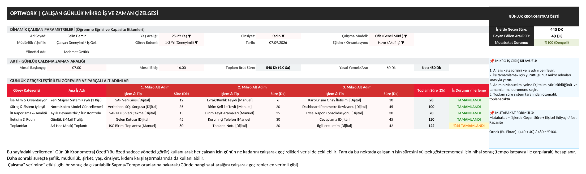
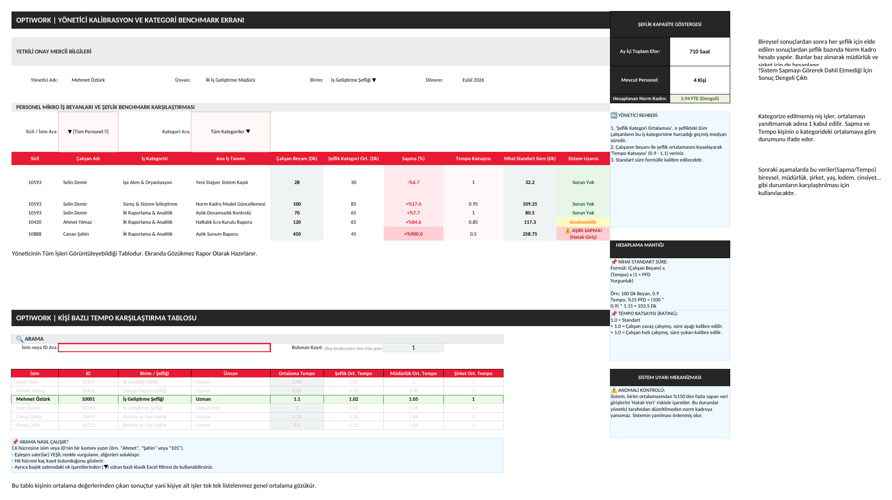
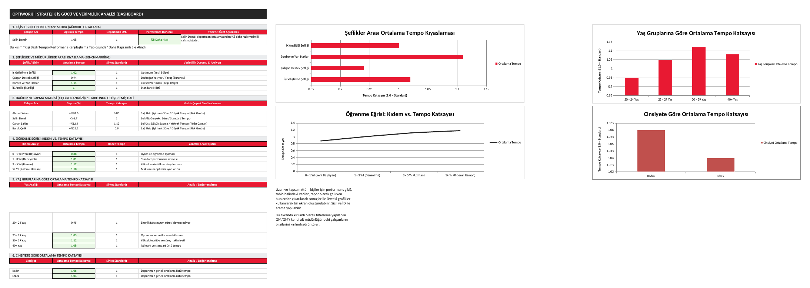

# Excel Design

Before the interactive HTML/JS dashboard (OPTIWORK) was built, the entire
scoring logic — normalization rules, deviation thresholds, tempo
coefficients, PFD allowance, and the FTE (norm staffing) formula — was
first designed and validated in Excel. This workbook is included here to
document that design process and show the reasoning behind every rule
before it became code.

File: `THY_Norm_Kadro_Prototype.xlsx`

| Sheet | Content |
|---|---|
| `1_Çalışan_Formu` | Employee daily time-entry form. Shift start/end and a task broken down into "micro-steps," each with its own duration. Gross/net duration, the legal break deduction, and a reconciliation rate are calculated automatically. |
| `2_Yönetici_Kalibrasyon` | Manager calibration & benchmark screen. Compares each employee's reported duration against the team's benchmark average, derives a deviation (%) and a tempo coefficient, and flags outliers automatically. |
| `3_Analiz_ve_Grafikler` | Strategic workforce analytics dashboard. Six analysis blocks (individual performance, team benchmarking, a deviation/tempo quadrant matrix, tempo-by-tenure, tempo-by-age, tempo-by-gender), each paired with a chart. |

> Note: sheet names and on-screen labels inside the workbook are in
> Turkish (it was built for a Turkish-speaking HR audience); this README
> describes it in English for the repository.

---

## 1. Employee Daily Micro-Task & Time Log

The data entry layer. Each employee logs their shift start/end time and
breaks their workday down into main tasks and micro-steps (e.g. a task
like "New Intern System Registration" is split into SAP data entry,
document verification, and access-card communication, each with its own
duration). The sheet automatically computes gross duration, the legal
break deduction (60 min if the shift ends after 12:00), net capacity, and
a reconciliation rate comparing logged task time against net capacity.
This is the raw input every downstream calculation is built on.

## 2. Manager Calibration & Category Benchmark

The manager-facing calibration layer. For every task category, the sheet
compares each employee's self-reported duration against the department's
benchmark average and derives a deviation % and a tempo coefficient:

| Deviation | System Flag |
|---|---|
| within normal range | "No Issue" |
| moderately high/low | "Review Suggested" |
| extreme (e.g. +900%) | "⚠️ Extreme Deviation (Likely Data Entry Error)" |

This is where the two-pass, outlier-resistant benchmarking idea (later
implemented as `computeForDonem()` in the JS engine) was first designed
and manually tested against sample data — including a deliberately
planted outlier row used to validate the flagging logic. A second table
on the same sheet aggregates each person's average tempo against their
team, department, and company averages, the direct ancestor of
`personTempoMap()`.

## 3. Strategic Workforce Analytics Dashboard

The executive view. This sheet is where the weighting logic and final
formula structure (tempo × PFD allowance = final standard duration) were
prototyped and sanity-checked visually before being generalized into the
FTE (norm staffing) formula used in the production dashboard.

---

## Why this is in the repo

Keeping the original Excel design alongside the production code shows the
actual design process: rules and thresholds were reasoned about and
tested by hand, on real-looking sample data, before being coded. It's a
useful reference for anyone reviewing the logic in `optiwork-math-core.js`
who wants to see where a specific rule (e.g. the 90-minute legal break, or
the deviation thresholds) originally came from.

