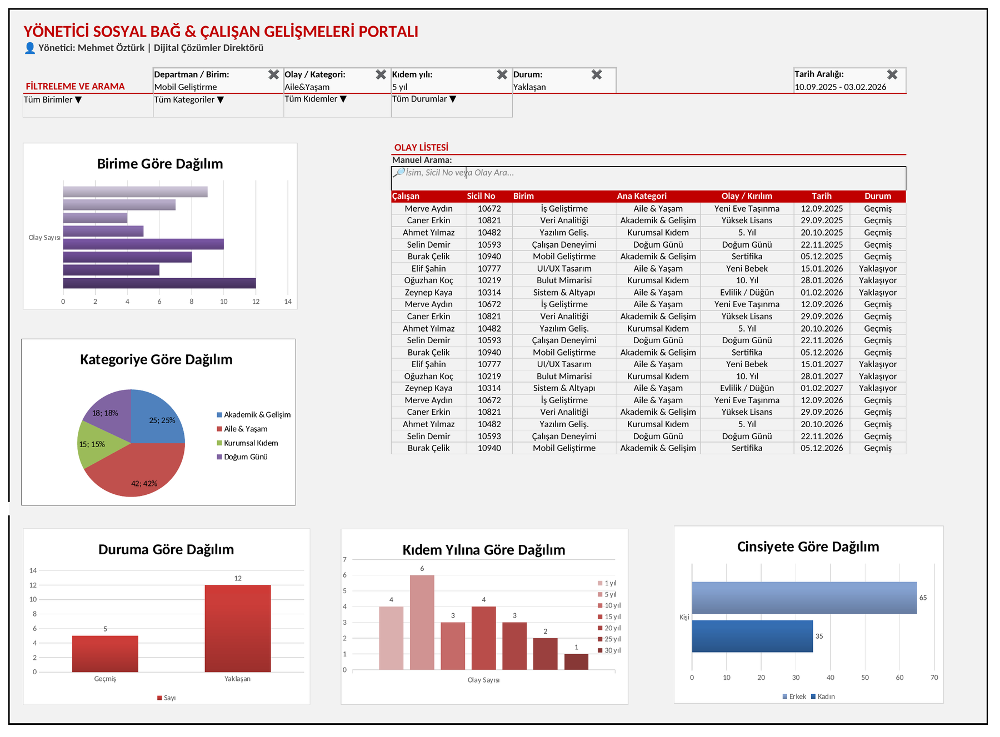
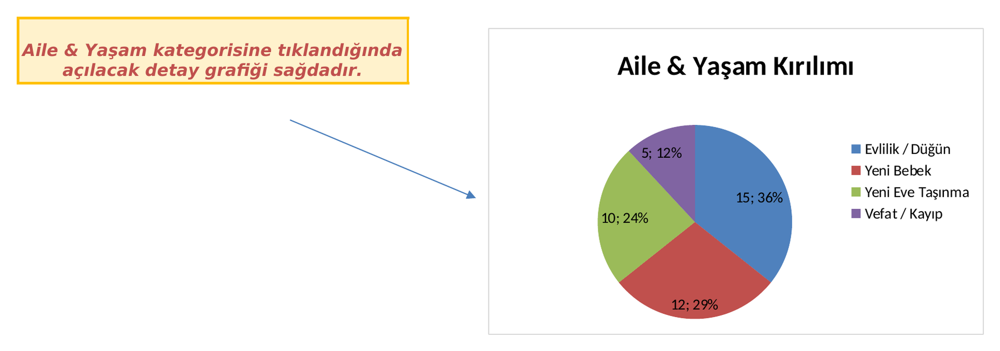
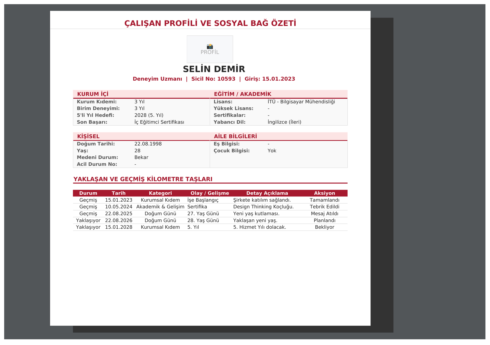
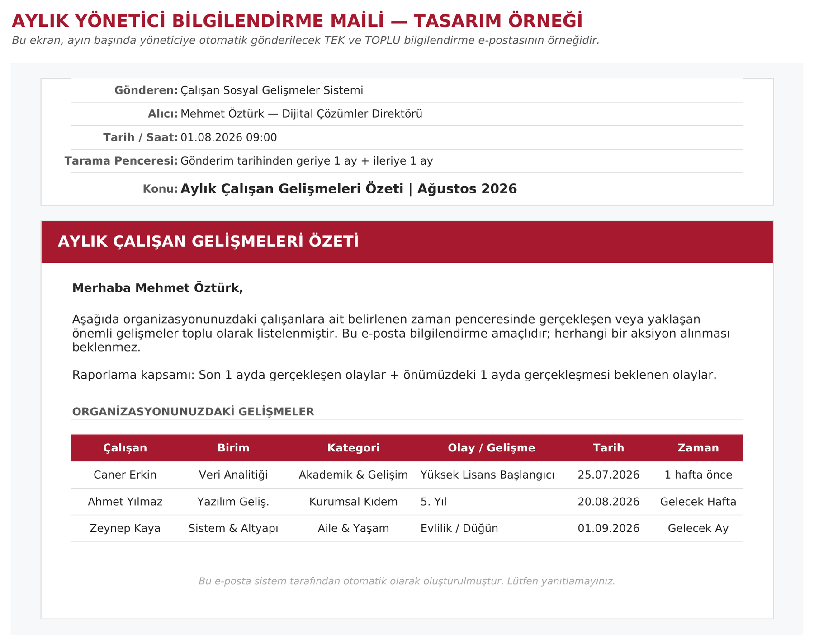

# Excel Tasarımı

Portalın web sürümünden önce ekranlar, iş kuralları ve e-posta şablonu Excel'de tasarlandı. Web arayüzü bu tasarım esas alınarak geliştirildi.

Dosya: `Yonetici_Sosyal_Bag_Dashboard.xlsx`

| Sayfa | İçerik |
|---|---|
| BT_ANA_EKRAN_PROTOTIP | Filtreler, olay listesi ve dağılım grafikleri; her bileşenin çalışma kuralları yan notlarda |
| BT_CALISAN_DETAY | Çalışan profil sayfası ve kilometre taşları |
| BT_AYLIK_MAIL_TASARIMI | Aylık yönetici bilgilendirme e-postası |

## Gösterge paneli

## Kategori kırılımı

## Çalışan detay sayfası

## Aylık yönetici e-postası

> Tasarımdaki tüm kişi ve olay verileri örnek amaçlıdır.
